<p align="center">
  <picture>
    <source media="(prefers-color-scheme: dark)" srcset="./assets/logo-dark.png">
    <source media="(prefers-color-scheme: light)" srcset="./assets/logo-light.png">
    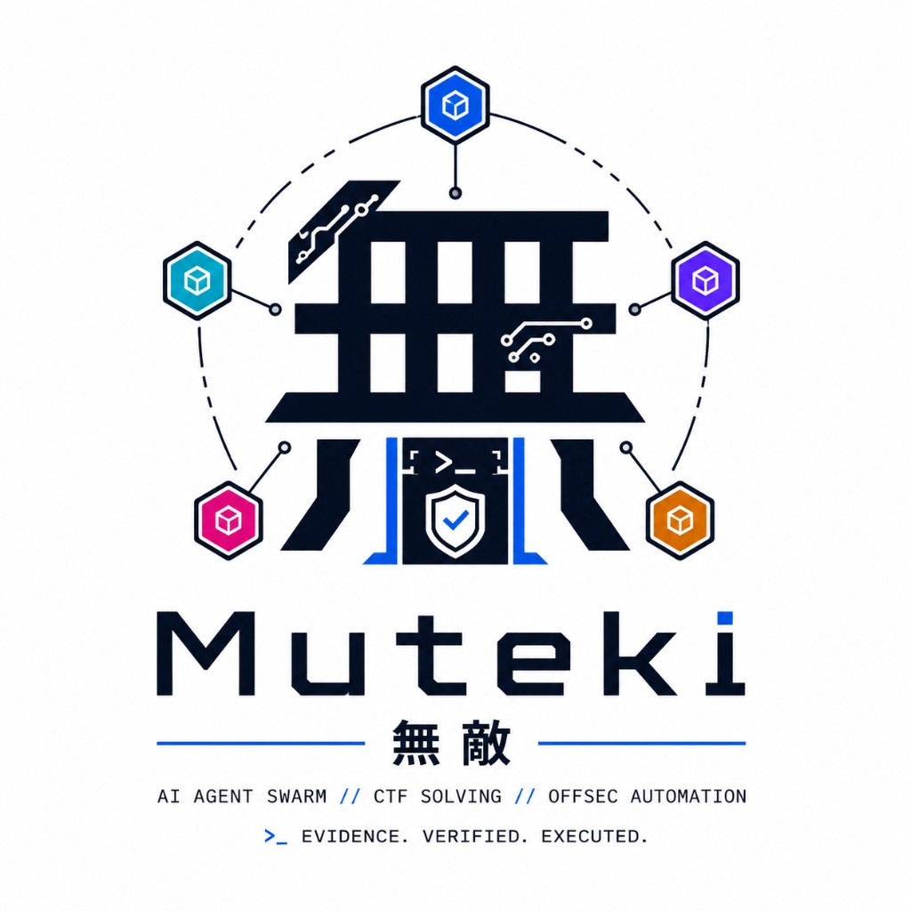
  </picture>
</p>

<h1 align="center">無敵 · Project Muteki</h1>

<p align="center">
  <strong>Heterogeneous Multi-Model AI Agent Swarm · Autonomous Offensive & Defensive Security Automation</strong>
</p>

<p align="center">
  <a href="https://github.com/FishCodeTech/muteki/blob/main/LICENSE"></a>
  <a href="https://www.python.org/"></a>
  <a href="https://github.com/FishCodeTech/muteki/stargazers"></a>
  <a href="https://github.com/FishCodeTech/muteki/issues"></a>
  <a href="https://github.com/FishCodeTech/muteki/pulls"></a>
  
  
</p>

<p align="center">
  <strong>English</strong> · <a href="README_CN.md">简体中文</a>
</p>

---

This is a **truly open-source, multi-model CTF-solving AI agent swarm.** The goal is to live up to its very name — **無敵 · Project Muteki** ("Invincible").

At its core, the project implements a scheduling scheme for AI agents that automatically and intelligently coordinates and controls each agent's context — like a swarm, each with its own division of labor, but all working toward the final goal. It currently supports commanding and dispatching only cursor, codex, and Claude Code. More kinds of CLI agents will be supported through continuous iteration.

Muteki exists to solve a specific problem: a single AI agent, when working toward a goal, very easily falls into a dead-loop at one spot — unable to pull itself out, unable to reach the final goal — and a single agent is extremely inefficient. I designed an architecture to solve this. It may not be the most perfect one, but I'll keep iterating and upgrading it.

CTF is only the most basic capability. The core architecture is built for goal-driven multi-agent collaboration across all kinds of scenarios; in real-world testing it can autonomously complete penetration testing, code auditing, CTF solving, cybersecurity work, and more.

> ## ⚠️ Runtime trust boundary — read before running
>
> Muteki is an **offensive security automation tool**. It drives CLI agents to execute commands, invoke security tools, and reach target services;
> **it does not promise to isolate malicious challenges**.
>
> It is recommended to **run it only in a dedicated, disposable environment** — a dedicated VPS, a throwaway VM, or a standalone machine with no sensitive data. Do not run it on
> your main workstation, a shared host, or a production environment. See [SECURITY.md](SECURITY.md) for details.
>
> That said, I personally just run it straight on my own computer all the time, because setting up the environment that way is more convenient (

---

## What can it do?

At RIFFHACK 2026, fully automated for 3 hours with zero human takeover, it speed-ran and AK'd (solved every) challenge — taking 8th place.

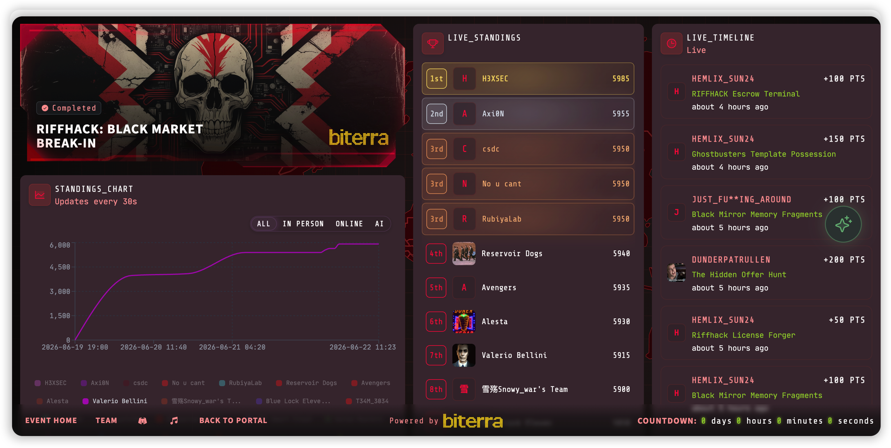

On the iChunQiu Yunjing penetration-testing range "blackmaze" — zero solves for three months — Muteki speed-ran the first blood in 2 hours. (Why does the platform show 39 hours? Because during that time I was dealing with all sorts of debugging, testing, and multi-flag mode support, which wasted a lot of time; the actual solving took only 2 hours.)

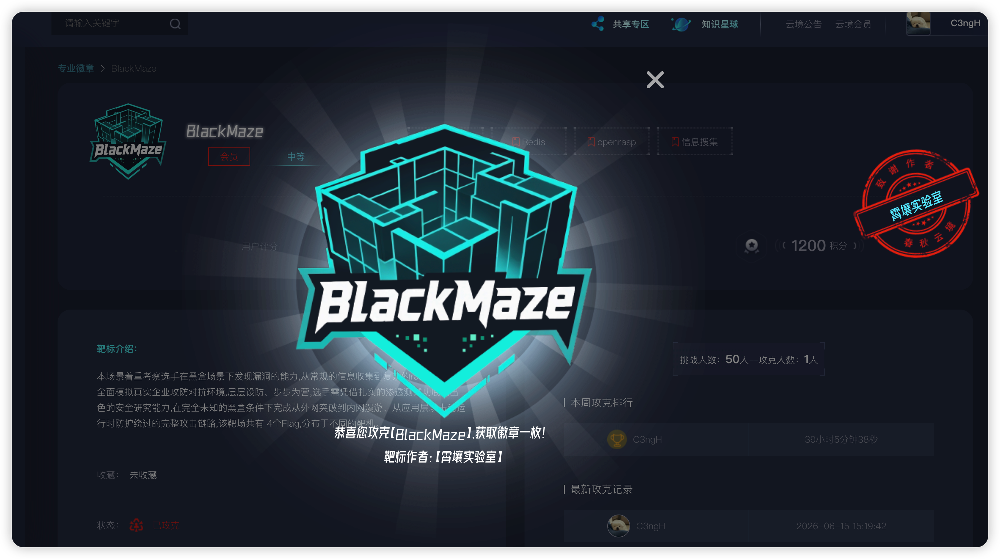

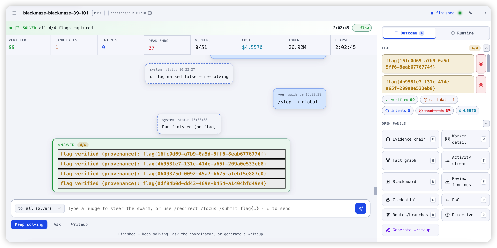

AK'd all badge scenarios on Qianxin Yunjing.

AK'd all categories of HackTheBox Insane and Hard difficulty.

For the full NYU CTF benchmark evaluation results, see the end of this document.

Many more first-bloods and high scores — across competitions you know and ones you don't — all bear Muteki's mark; I won't enumerate them one by one here.

In short, after a month of engineering optimization, architecture/capability tuning, and bug fixing, this project is now officially open-sourced — no star-baiting, no boastful marketing copy, no undermining your confidence, no sub-groups, no community gatekeeping, no money scams, no paywalls, no marketing — just open-sourced and shared directly.

You're welcome to use it and help build and upgrade it together. If you run into any problems, feel free to open an issue, and you're welcome to join the discussion group. Let's build the world's strongest CTF agent together.


---

## Architecture

Muteki points a group of heterogeneous coding agents (Claude Code / Codex / cursor-agent) at the same challenge, collaborating on a single **shared blackboard**: facts one of them discovers are usable by all, dead ends one of them walks are never retried by the others, and a flag is accepted only when it **appears verbatim in real execution output**. The core isn't "swap in a smarter brain" — it's **heterogeneity + shared evidence + a provenance gate**.

So how does a worker hand its data to the platform, and how does it see its teammates' progress? **It all relies on the `muteki-blackboard` skill built into every worker** — this is the only data channel between a worker and the blackboard.

For a detailed architecture explanation, see: [docs/工作原理.md](docs/工作原理.md)

The project follows a "less is more" principle: it injects no security tools and no security knowledge, keeps the network open, and lets workers improvise freely — writing and installing their own dependencies and scripts.

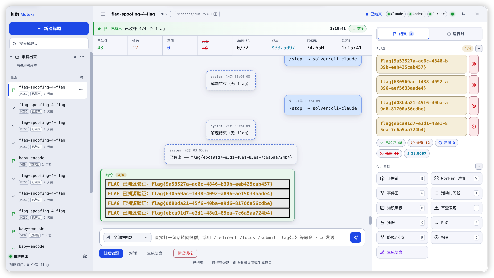

> *Web command deck: the run list on the left, the coordinator conversation stream in the middle, and a live run control panel with per-worker status on the right.*

### One picture: solve phases × agent loop

The outer `①②③④` are the four phases of a single run; the inner `(1)~(5)` are the per-tick collaboration loop of phase ③. All the hard work on tough challenges happens inside the ③ loop, and every read/write between a worker ↔ the blackboard inside that loop goes through the `muteki-blackboard` skill.

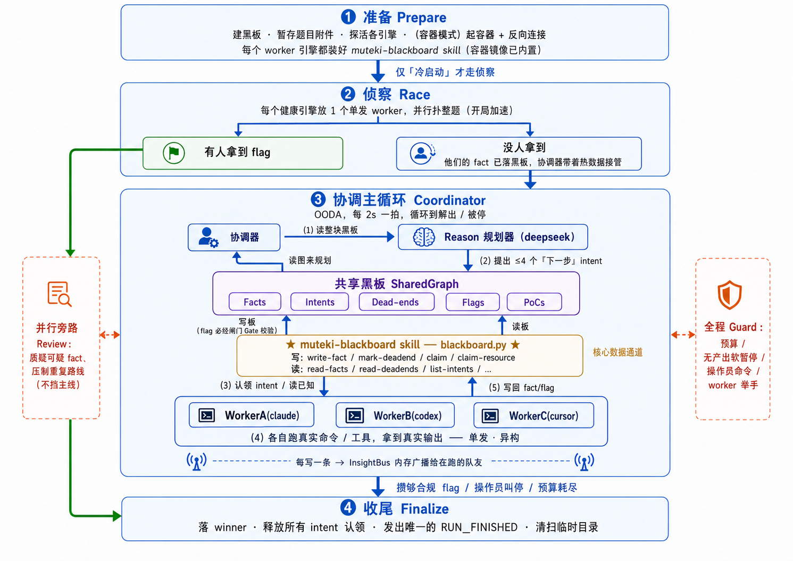

**One lap of `(1)→(5)` is the heart of Muteki**: the coordinator reads the blackboard → Reason plans the next step → an intent goes onto the blackboard → workers each claim one and run real commands → **the results are written back to the blackboard via the skill (flags still have to pass the gate)**, then it reads again… one lap every 2 seconds — that's how hard challenges pile evidence thicker, lap after lap. The outer `①②③④` is the full timeline of a single run.


| Phase | When it starts | What it does | Output |
| ------------- | --------------------- | ------------------------------------- | --------------------- |
| **① Prepare** | At the start of a run | Build the blackboard, stage attachments, health-check engines, install the skill, and (in container mode) start containers + reverse connection | Empty blackboard + available engines + channels wired up |
| **② Recon Race** | Cold start only (skipped when re-examining an already-solved challenge) | Multiple engines single-shot the whole challenge in parallel for breadth-first recon | A flag (→ fast path) or a batch of facts |
| **③ Coordination main loop** | When recon didn't solve it directly | `(1)~(5)` keeps looping, expanding the swarm as evidence grows | The blackboard keeps growing until there's enough for a flag |
| **④ Wind-down** | Enough for a flag / operator stops / budget exhausted | Persist the winner, release claims, emit terminal events, clean up | RUN_FINISHED + a replayable blackboard |


To keep Muteki from falling into a dead-loop while working a single task, we set up a review mechanism: while Muteki executes the task, it periodically runs a review that checks and verifies the facts already recorded, then corrects course promptly whenever needed.

---

## Quick start

```bash
# 1. Bootstrap: install deps + run the quick test suite
./init.sh

# 2a. Web command deck — FastAPI backend (:8000) + production Next UI (:3001)
./run.sh web
#     Backend only:  ./run.sh web --backend-only
```

The `.env` at the repo root is loaded automatically (copy it from `.env.example`); variables exported in your shell always take precedence. Configuration is done through `MUTEKI_*` environment variables.

Recommended setting:

```
MUTEKI_DEEPSEEK_API_KEY=sk-xxxx
```

This is mainly the credential used to set up the Reason planner that plans the whole agent pipeline. You can also swap it for any other endpoint, and configure the model in the frontend settings. The default is DeepSeek, because it's relatively cost-effective.

If you don't set it, the main impact is that the Reason planner won't autonomously plan challenges or summarize progress.

---

## Requirements

- **[uv](https://docs.astral.sh/uv/)** — Python toolchain and runner
- **Python ≥ 3.13** (declared in `pyproject.toml`; managed by `uv`)
- **Node.js** — only needed for the local web UI (`apps/web/ui`, Next.js)
- **Go ≥ 1.26** — only needed when building the in-container supervisor inside the worker image
- **Docker** — only needed for the `container` worker backend / building the worker image
- The **engine CLIs** you intend to use, available on your `PATH` (see below)
- This project has so far only been tested on macOS, not on Windows — handle accordingly.

### Proprietary engine CLIs

Muteki **shells out to** the three closed-source agent CLIs below; install and authenticate whichever ones you want to use. Each has its own license and sends data back to its respective vendor:


| Engine | CLI | Vendor | Credential |
| -------- | ------------------------------------ | --------- | ----------------------------------- |
| `claude` | `@anthropic-ai/claude-code`          | Anthropic | OAuth token (`claude setup-token`)   |
| `codex`  | `@openai/codex`                      | OpenAI    | `~/.codex/auth.json` (`codex login`) |
| `cursor` | `cursor-agent` (`cursor.com/install`) | Cursor    | API key                             |


You need at least one of them to run. Beyond these three, you can also configure a **custom OpenAI-compatible endpoint** (`base_url` + key) in a worker profile — suitable for self-hosted or third-party models. Credentials are read from the macOS Keychain / environment and injected into the worker environment; see [Credentials](#credentials) and [SECURITY.md](SECURITY.md).

---

## Credentials

The three agents' credentials are configured along with the web settings. In local mode you can skip configuring them — you just need your subscription to be usable when you run the CLI yourself.

The remaining cases are generally for configuring remote or container environments, where container credential information is involved.

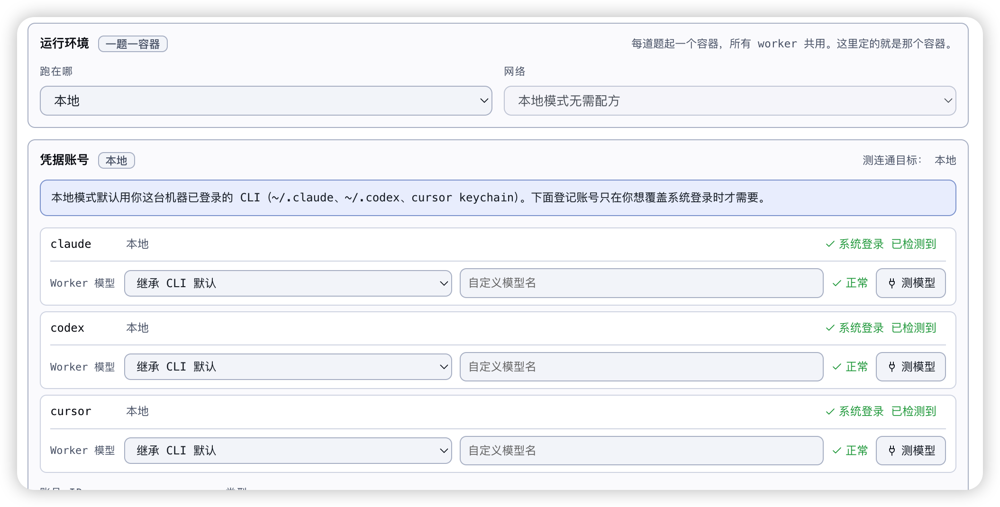

In container mode, or in other cases where you need to use a key, you can configure it as follows:


| Engine | File in the account directory | How to get it |
| -------- | ------------------------- | ------------------------------------- |
| `claude` | `CLAUDE_CODE_OAUTH_TOKEN` | `claude setup-token`                  |
| `codex`  | `codex-home/auth.json`    | `codex login` (copy `~/.codex/auth.json`) |
| `cursor` | `CURSOR_API_KEY`          | cursor.com → API key                  |
| Custom endpoint | `API_KEY` + `BASE_URL`    | Any OpenAI-compatible vendor          |


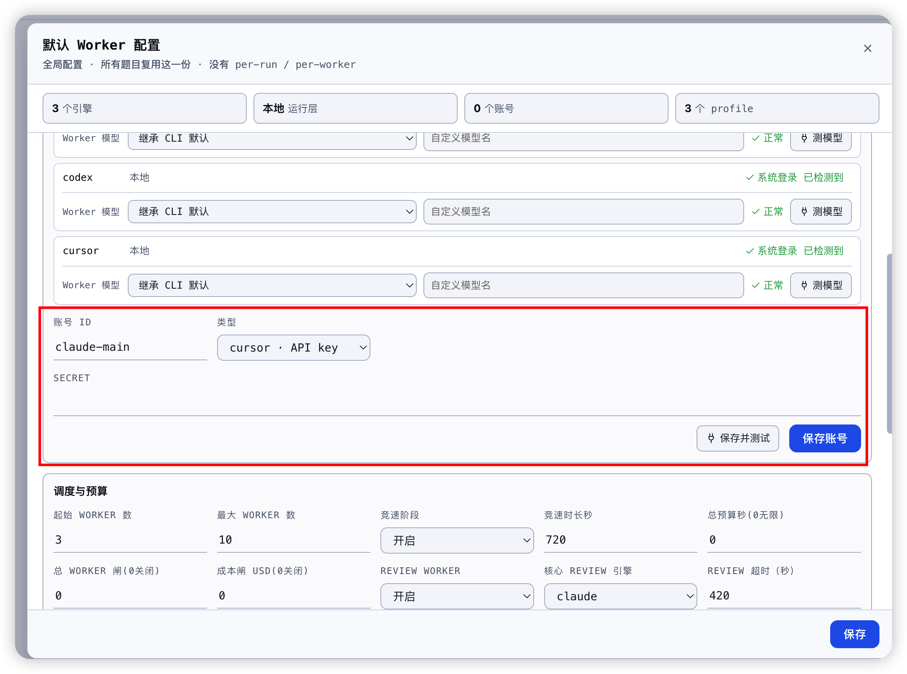

After saving, you can click "Save & test" at any time.

**local vs container mode:**

- In **`container`** mode an account is **mandatory** — the host login is not mounted into the container; credentials are mounted into the container via command injection and file mounting.
- In **`local`** mode, if no account is registered, the worker inherits the host CLI's existing login — though you can also configure it manually.

The DeepSeek reasoning model (used by the coordinator, not a worker engine) is configured separately via `MUTEKI_DEEPSEEK_API_KEY` in `.env`.

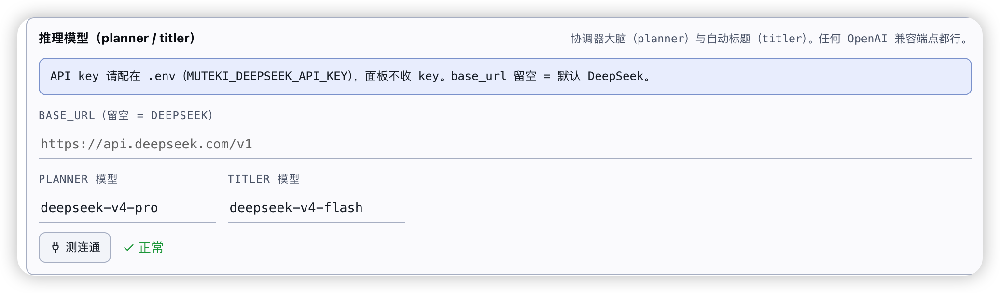

For the credential trust model, see [SECURITY.md](SECURITY.md).

### Worker images (container backend)

The `container` backend runs workers in sibling Docker containers launched by the web API. The default worker is **one general-purpose Kali image** (not per-template variants) with the CTF toolchain, offline knowledge, engine CLIs, and the supervisor. **No credentials are baked into any image** — accounts and keys are injected at runtime.

Official release images are published to GHCR:

| Image | Use |
| --- | --- |
| `ghcr.io/fishcodetech/muteki-worker:latest` | Full Kali worker image for real CTF runs. Large, but contains the expected exploit/reversing toolkit. |
| `ghcr.io/fishcodetech/muteki-worker-slim:latest` | Lightweight worker for wiring tests and constrained deployments. It has the supervisor and engine CLIs, but not the full Kali toolkit. |
| `ghcr.io/fishcodetech/muteki-web:latest` | FastAPI control plane image produced by the release pipeline. |
| `ghcr.io/fishcodetech/muteki-ui:latest` | Next command deck image produced by the release pipeline. |

For a normal compose deployment, pull the worker image on the host Docker daemon:

```bash
docker pull ghcr.io/fishcodetech/muteki-worker:latest
```

The app defaults to `ghcr.io/fishcodetech/muteki-worker:latest`. Override it with `MUTEKI_WORKER_IMAGE`, for example:

```bash
MUTEKI_WORKER_IMAGE=ghcr.io/fishcodetech/muteki-worker-slim:latest ./run.sh web
```

**Or build a worker image locally:**

```bash
./docker/worker/build.sh
./docker/worker/build.sh ghcr.io/fishcodetech/muteki-worker 0.2.5
./docker/worker-slim/build.sh ghcr.io/fishcodetech/muteki-worker-slim 0.2.5 amd64
```

The full image is intentionally large (Kali headless + Ghidra + SageMath via conda + offline knowledge). Use the slim image only when you understand that workers may need to install more tooling during a run.

---

## Deployment

There are two supported ways to run the command deck.

### A) Local (recommended for a single operator)

Launch it on your own machine — log in, install the relevant worker CLIs, start it whenever you like. The web process runs on the host; workers run either as host CLIs (`local` backend) or as sibling containers (`container` backend).

```bash
./run.sh web
# visit localhost:3001
```

`./run.sh web` runs the Next UI as a production build/server, not the Next dev server. The first run builds `apps/web/ui/.next`; use `./run.sh web --rebuild-ui` after changing UI code or changing the baked backend URL. Useful flags:

```bash
./run.sh web --host 0.0.0.0 --ui-port 3001
./run.sh web --backend-only
```

By default this binds to loopback, so a password is optional. If you expose the backend on a non-loopback host (`./run.sh web --host 0.0.0.0`), you **must** set `MUTEKI_WEB_PASSWORD` first — the server refuses to start otherwise, so the `/api` surface (including subscription tokens) is never exposed unauthenticated. See the P3 auth block in [`.env.example`](.env.example).

### B) Docker Compose (the whole control plane, containerized)

`docker-compose.yml` brings up the **control plane in containers** — FastAPI coordinator + Next UI — with one command. Workers are still launched as sibling containers by the host Docker daemon. This is the path for **running on Linux or Windows without depending on the host OS**: instead of making the bare host portable (POSIX signals, `C:\` path translation, console-codepage encoding all differ), the control plane runs inside Linux containers and the host OS stops mattering.

Topology:

- **`web-api`** — FastAPI coordinator. Mounts the host docker socket and launches **worker containers as siblings on the host daemon** (not dind). The in-container supervisor dials back to `web-api:9100` over `muteki_net`.
- **`ui`** — Next command deck; proxies `/api` → `web-api`.
- **workers** are *not* a compose service — `web-api` `docker run`s one per run.

```bash
# 1. Have the worker image available on the host daemon.
#    Compose builds web-api/ui from this checkout, but it does NOT build workers.
docker pull ghcr.io/fishcodetech/muteki-worker:latest

# 2. Bring up the control plane. Two vars are REQUIRED:
#    - MUTEKI_HOST_DATA_ROOT: an absolute HOST path, bind-mounted at the SAME path
#      into web-api so worker mounts (resolved by the host daemon) hit real host paths.
#    - MUTEKI_WEB_PASSWORD: compose binds the deck to 0.0.0.0, so a password is mandatory.
MUTEKI_HOST_DATA_ROOT=/opt/muteki/data \
MUTEKI_WEB_PASSWORD='choose-a-strong-one' \
  docker compose up --build

# 3. visit http://localhost:3001  (UI port overridable via MUTEKI_UI_PORT)
```

Use `MUTEKI_WORKER_IMAGE=ghcr.io/fishcodetech/muteki-worker-slim:latest` only for smoke tests or deployments where workers can install missing tools themselves. For real CTF runs, prefer the full worker image.

In container mode the platform enforces **strong consistency**: when the web process detects it is running inside a container, it *requires* the container worker backend and **refuses to fall back to a host-native CLI** — a missing image / unreachable socket / wrong network fails the run loudly instead of silently launching the wrong thing. The `local` toggle is hidden/locked in the UI.

The full env contract (and which vars compose sets for you automatically — don't set those by hand) is documented in [`.env.example`](.env.example).

> ⚠️ **Cross-platform status.** The compose path is exercised on macOS + Docker Desktop (mounts, networking, `host.docker.internal`). **Windows + Docker Desktop has not been validated on real hardware** — `C:\` drive-letter mount syntax and UTF-8 console output can only be confirmed on an actual Windows box. Linux hosts follow the macOS path. Treat Windows compose as untested until someone runs it end-to-end. Container mode in general is still less battle-tested than local mode.

---

## Best practices

1. After opening the project, you'll land on a page like this
   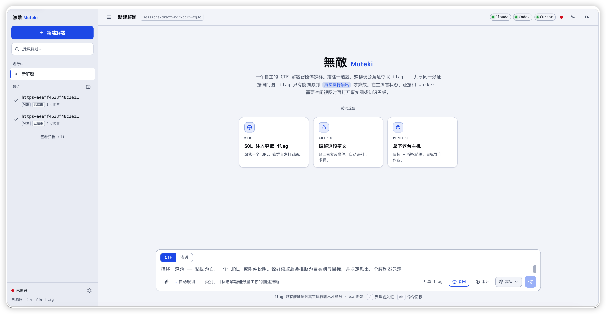
2. First, open the settings page in the bottom-left, check the engines you want to field, and configure your worker models.
   For model selection: if you already hold the Cyber / CVP certification, I recommend Opus 4.8 and GPT-5.5; if not, I personally recommend GPT-5.4 and Opus 4.6. For Cursor I personally recommend Compose 2.5, which works wonders on easy challenges.
   Of course, you can also configure custom domestic models via a custom base_url (DeepSeek, Kimi, GLM).
   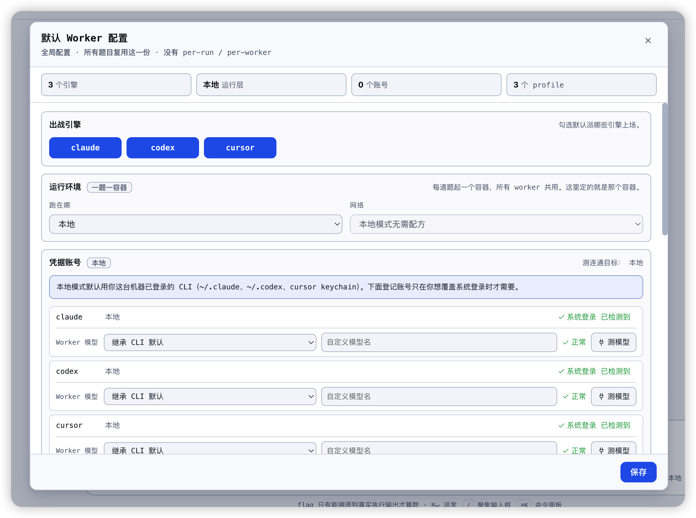
3. For the runtime environment, local is recommended; if you have special needs you can choose container, which will remind you to configure the relevant credentials — please configure those yourself. You can click "Test model" to check whether it works correctly; the test invokes the agent and asks the model to repeat "ok".
   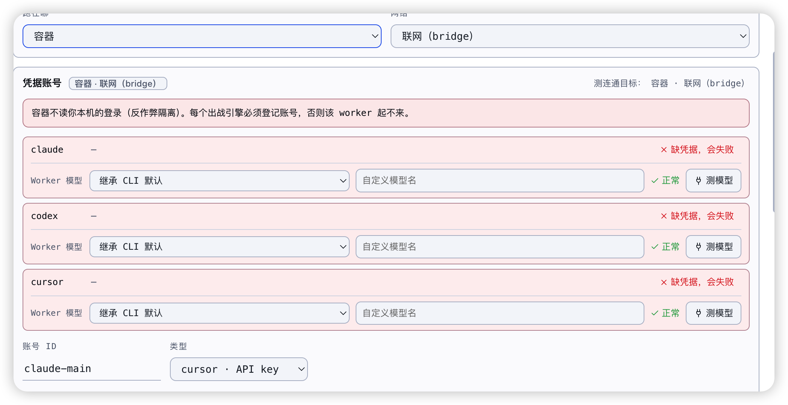
4. Next, you can configure your workers in detail; configuring them as shown in the picture is recommended.
   The starting worker count is the number for the race phase; it follows your engine count and runs all three agent engines simultaneously until the flag is solved or the challenge times out. It's used for quickly grabbing first blood and quickly solving easy challenges.
   The maximum worker count is recommended to stay around 5–6, because for web challenges too many workers could cause a DDoS-like situation.
   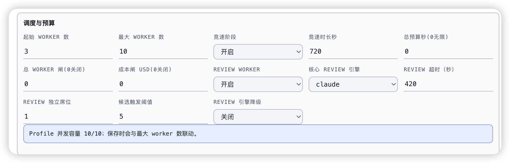
5. It's recommended to configure and test connectivity for the reasoning model here, for better planning and pacing of the challenge.
   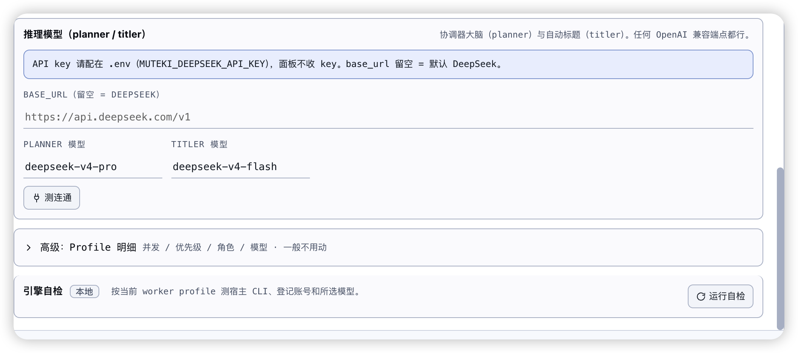
6. Once everything is configured, you can click "Run self-check"; if there are no issues, save and close the settings page.
7. The recommended prompting approach for solving a challenge is as follows:
   1. State the challenge description, category, name, website/URL, and flag format.
   2. The frontend also supports copy-paste and file upload, so you can directly upload attachment-based challenges.
   3. The "network" toggle in the picture controls whether the agent's own web-search capability is enabled; it's on by default, and turning it off is for benchmark evaluation.
   4. Ignore the local/container button — it's tied to the settings feature and may be removed later. Under "Advanced" you can manually specify the flag format and a few simple settings, which can be ignored.
      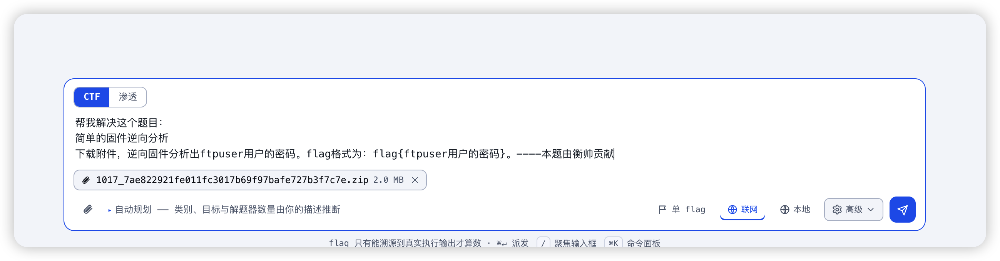
      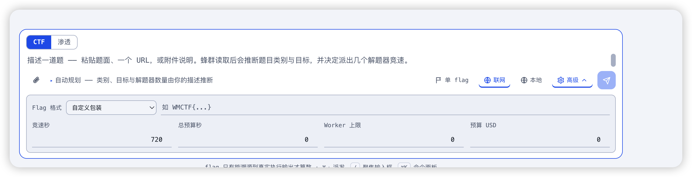
8. After starting, it initializes for about half a minute — initialization involves file setup and config-file setup, which is a bit slow — and then you'll enter the main page.
   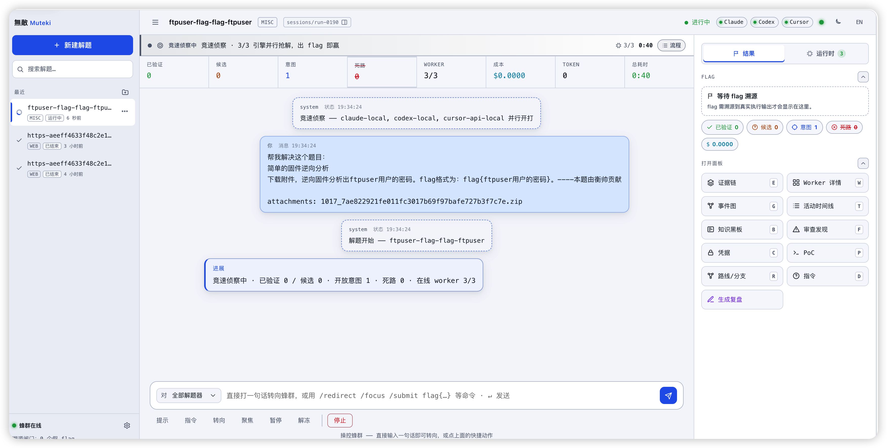
9. 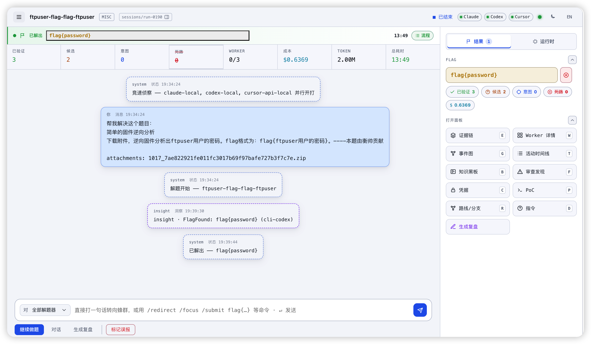
10. After a challenge is solved, you can use the "x" in the top-right to report a specific flag as a false positive, which will spin workers back up to keep re-solving; you can click "Generate writeup" to generate it directly.
11. The other pages are for viewing or exploring on your own — feel free to try and use them.

---

## Evaluation

Muteki was fully evaluated on the **NYU CTF Bench** `test` set (CSAW 2017–2023, 200 challenges in total). The results are as follows:

### Capability evaluation (host toolchain)

In this evaluation, no security or reverse-engineering tools were preinstalled; only a single x86 Ubuntu 24 VPS was prepared as the evaluation environment.

Covering all six major categories and spanning the full CSAW difficulty range across 200 challenges, with a 30-minute budget per challenge:


| Metric | Value |
| ---------------- | -------------------------------- |
| Solved | **200 / 200 = 100%** |
| Hard/Expert tier (difficulty leaderboard) | **36 / 36 all solved** |
| Cumulative tokens | ~370 M |
| Cumulative cost | ~$214 |
| Solve time | median ~2–4 min (fastest 22 s) |
| Winners per engine | cursor 80 · claude 75 · codex 45 |


The three engines' blind spots don't overlap — together they sweep all six categories, including CSAW top-tier challenge types such as V8-engine pwn, Windows remote privilege escalation, and 16 GB disk-image forensics. Full report:
[eval_nyu/_reports/FINAL_eval_report.md](eval_nyu/_reports/FINAL_eval_report.md),
with per-challenge details in [eval_nyu/_reports/RESULTS.md](eval_nyu/_reports/RESULTS.md).

> Engine/model versions change as the CLIs update (workers shell out and run each CLI's own default model: Claude Opus 4.7 / GPT-5.5 / Cursor).
> Treat these numbers as a capability snapshot, not a leaderboard verdict.

---

## Repository structure


| Path | Contents |
| -------------------- | --------------------------------------------------------------------------------- |
| `muteki/`            | Core: `swarm/` (coordinator), `solver/` (CLI driver, gate, control plane), `models/`, `platform/`, `sandbox/` |
| `apps/web/`          | FastAPI backend (`server.py`) + Next.js operator UI (`ui/`)                        |
| `apps/tui/`          | Textual TUI command deck (unfinished)                                             |
| `cmd/runtime-agent/` | In-container Go supervisor (reverse-connects to the control plane)                 |
| `docker/worker/`     | Worker image (Dockerfile, build scripts, tool-awareness map)                      |
| `scripts/`           | eval / backtest harness                                                            |
| `docs/`              | eval reports + open-source-readiness review; design docs in `docs/internal-design/` |


### Working directory of a single runner (challenge)

Each challenge you launch is a **run**. Its working path and structure under `sessions/` is as follows — workers on both the `host` and `container` backends see the same layout:

```
sessions/
├── run-XXXX.jsonl              # The "event stream" for this challenge: the source of truth for SSE replay / resume (one line = one event)
├── run-XXXX/                   # The working root for this challenge
│   ├── uploads/                # Raw challenge files uploaded via the web (unprocessed; processed ones go to workspace/inputs)
│   └── workspace/              # The workspace for this challenge
│       ├── inputs/             # Immutable challenge inputs (content-addressed, CAS)
│       │   ├── objects/        #    CAS object store (bucketed by sha256)
│       │   └── by-name/        #    Symlinks from original filename → object
│       ├── shared/             # Artifacts shared between workers (CAS)
│       │   ├── objects/        #    CAS object store
│       │   ├── links/          #    Symlinks by name → object
│       │   └── index.jsonl     #    Shared-artifact index (a rebuildable materialized view)
│       ├── graph/
│       │   └── shared_graph.db #    ★ Shared blackboard: event-sourced SQLite, the single source of truth (facts/intents/dead-ends/...)
│       ├── arts/               # Artifact store: tool output / transcript snapshots (<hex>.txt, addressed by artifact_id, peekable)
│       ├── workers/            # Each worker's own cwd (scratch)
│       │   └── cli-codex-2/    #    One worker's working directory (agent temp files + relative symlinks into inputs/shared)
│       ├── homes/              # Each worker's isolated HOME (especially needed in container mode)
│       ├── final/              # Final artifacts
│       ├── tmp/                # Temp directory
│       ├── logs/               # Logs
│       ├── manifest.json       # Workspace manifest: topology + inputs list + runtime metadata
│       ├── winner.json         # The winning worker's continuation handle (for follow-ups / writeups / review after solving)
│       ├── writeup.md          # The (post-solve generated) writeup, optional
│       └── .muteki_board.md    # Blackboard snapshot: a Markdown version for workers to read directly
│
├── _secrets/accounts/<id>/     # Credential account store (dirs 0700 / files 0600, never enters the image or prompts)
├── _worker_config.json         # Global worker config (engine roster / profiles)
└── _rail_meta.json             # Rail metadata (names / order of the run list)
```

A few key points:

- **`run-XXXX.jsonl` (the event history)** and **`run-XXXX/` (the files that do the work)** are linked by the same run id: the former can be replayed to the frontend, the latter is the workspace actually written to disk.
- **`inputs/` and `shared/` are both content-addressed (CAS)**: the same file is stored only once, and worker directories are full of relative symlinks — so `workers/` can be created and deleted at will without losing data.
- **`graph/shared_graph.db` is the core**: all of the blackboard's state lives here; workers read and write it through the `muteki-blackboard` skill.
- **Wind-down only clears the non-winner scratch under `workers/`**; `shared/`, `graph/`, `arts/`, `final/`, and `winner.json` are all kept, so a challenge can still be fully reviewed after it finishes.

---

## Testing

```bash
uv run pytest                              # Python suite (live tests auto-skip when no key is set)
go test -C cmd/runtime-agent ./...         # Go supervisor (the module lives under cmd/runtime-agent/)
( cd apps/web/ui && npx tsc --noEmit )     # UI type-check
```

---

## Roadmap / TODO

- [ ] Add authentication logic
- [ ] Fully optimize and test the container mode
- [ ] Keep iterating and improving the web UI experience
- [ ] Support more agent worker types, e.g. pi, zai, opencode, etc.
- [ ] TUI mode
- [ ] Fully automatic crawling of CTF-platform challenges, with auto-solving, auto-submission, and auto report generation

---

## Acknowledgements

Thanks to [c3](https://github.com/Real-C3ngH) for the cyber-range account — I burned through a lot of "grit" and farmed like crazy.

Thanks to master [l4n](https://github.com/lancer0rz) for the inspiration — the newly added reviewer brought a qualitative leap in overall solving efficiency.

Thanks to master [陈橘墨](https://github.com/Randark-JMT) for the range resources and writeups, used for extensive testing and fine-tuning.

~~Thanks to Sam Altman for not banning my account.~~ Now banned, I will always remember his name.

~~Thanks to Dario Amodei for not banning my account.~~ Now banned, I will always remember his name.
---

## License

[GNU AGPL-3.0](LICENSE)

---

## References

This project's design and evaluation drew on the following academic work:

1. **NYU CTF Bench: A Scalable Open-Source Benchmark Dataset for Evaluating LLMs in Offensive Security**
   Minghao Shao, Sofija Jancheska, Meet Udeshi, Brendan Dolan-Gavitt, et al. *NeurIPS 2024 Datasets & Benchmarks Track*.
   [arXiv:2406.05590](https://arxiv.org/abs/2406.05590)
2. **Teams of LLM Agents can Exploit Zero-Day Vulnerabilities**
   Richard Fang, Rohan Bindu, Akul Gupta, Daniel Kang. *EACL 2026*.
   [Paper](https://aclanthology.org/2026.eacl-long.2.pdf)
3. **D-CIPHER: Dynamic Collaborative Intelligent Multi-Agent System with Planner and Heterogeneous Executors for Offensive Security**
   Chenhui Zhang, et al. 2025.
   [arXiv:2502.10931](https://arxiv.org/abs/2502.10931)
4. **HackSynth: LLM Agent and Evaluation Framework for Autonomous Penetration Testing**
   Lajos Muzsai, David Imolai, András Lukács. 2024.
   [arXiv:2412.01778](https://arxiv.org/abs/2412.01778)
5. **CTFAgent: An LLM-powered Agent for CTF Challenge Solving**
   Jiaze Sun, et al. *Computers & Security*, 2025.
   [ScienceDirect](https://doi.org/10.1016/j.cose.2025.104488)
6. **Co-RedTeam: Orchestrated Security Discovery and Exploitation with LLM Agents**
   Jiahao Zhu, et al. 2025.
   [arXiv:2602.02164](https://arxiv.org/abs/2602.02164)
